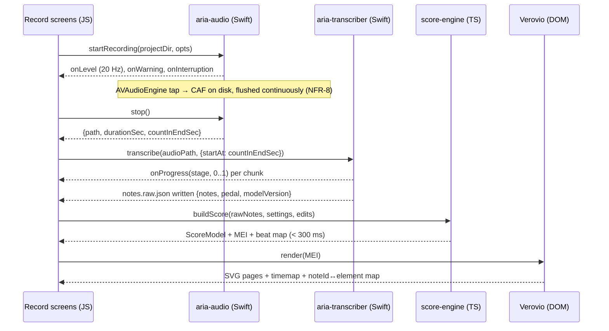

# Aria — Architecture & Engineering Spec (Expo)

Status: **Draft v1 for review** · Sep 28, 2026
Inputs: [`design-handoff/00-requirements.md`](design-handoff/00-requirements.md) (FR/NFR numbers), [`design-handoff/01-HANDOFF-SPEC.md`](design-handoff/01-HANDOFF-SPEC.md) (screens and behaviour), [`design-handoff/04-components/COMPONENTS.md`](design-handoff/04-components/COMPONENTS.md), [`design-handoff/02-design-tokens/tokens.json`](design-handoff/02-design-tokens/tokens.json).

This document says **how** we build Aria on Expo: what runs in TypeScript, what runs in Swift, how data is stored, how the pieces talk, and what we have to prove first. The requirements doc proposed native SwiftUI; §1 explains why Expo still fits and where the edges are.

---

## 0. Summary of decisions

| # | Decision | Why |
|---|---|---|
| D1 | **Expo (current stable SDK, New Architecture only), Expo Router, TypeScript, dev builds** — never Expo Go | We need custom native code (audio, Core ML, MusicKit, iCloud). Dev builds + Continuous Native Generation (CNG) keep `ios/` generated, not hand-maintained. |
| D2 | **Heavy work lives in local Swift Expo Modules** (`modules/`): audio engine, transcription, MusicKit, iCloud | Real-time audio, Core ML on the Neural Engine and Apple frameworks are Swift-only. The JS thread never touches audio samples. |
| D3 | **Score engine (rhythm → key → hands → spelling → MEI/MusicXML/MIDI) is a pure TypeScript package** | Deterministic, unit-testable in Jest with golden files, fast enough on Hermes (< 50 ms for a 10-min piece), and edit/re-generate (FR-19) stays in JS where the UI state is. |
| D4 | **Notation rendered by Verovio (WASM) inside an Expo DOM component**; OSMD as the fallback behind the same interface | Best engraving, MEI input keeps our note IDs for tap-to-edit and highlight, built-in timemap for the playback cursor, runs fully offline. Licence gate in Phase 0 (LGPL, §7.3). |
| D5 | **One native audio owner** (`aria-audio`) handles recording, previews, own recordings and the piano synth | A single `AVAudioSession` owner avoids the category fights you get mixing `expo-audio`, MusicKit and a recorder. We do not use `expo-audio`/`expo-av`. |
| D6 | **Project folder is the source of truth; SQLite is an index** | Each recording is a self-describing folder (`manifest.json` + audio + notes + edits). Crash-safe, trivially exportable, and iCloud Drive sync (FR-23) becomes "sync folders, rebuild index". |
| D7 | **Skia + Reanimated for anything that animates per frame** (waveform, level meter, piano roll, falling keys, scrubbers) | Runs on the UI thread at 60/120 fps without bridge traffic per frame. |
| D8 | **Tiny, sign-in-free recommendation API** (Cloudflare Workers + D1) that also proxies Apple Music catalog search/previews | No accounts (out of scope), holds the curated difficulty data, keeps the Apple Music developer key off the device. Listening history is reduced to genre weights **on device** (NFR-2). |
| D9 | **Phase 1 is a model + native spike**, before any screen polish | The only things that can sink the project are accuracy on phone audio, speed on A14/A15, and licences. Prove those first. |

---

## 1. Why Expo, and where the edges are

Roughly 70% of Aria is screens, lists, forms, local data and network — Expo's strengths (fast iteration, Fast Refresh, EAS Build/Submit/Update, a big library of maintained modules). The other 30% (recording, transcription, MusicKit, iCloud, synth) must be Swift in either approach; in Expo it lives in Expo Modules with a typed TS surface.

| Concern | Native SwiftUI | Expo (this spec) | Mitigation |
|---|---|---|---|
| Glass/blur fidelity | `.ultraThinMaterial` everywhere, cheap | `expo-blur` is a real `UIVisualEffectView`, but many in a scrolling list cost frames | Real blur only on tab bar, sheets and hero cards; list cards use the translucent `glass` fill without blur (visually near-identical over a smooth gradient). §6.3 |
| Audio / ML | First-class | Same Swift code, wrapped in Expo Modules | — |
| Score rendering | Verovio C++ linked in, or WKWebView | Verovio WASM in a DOM component (a WKWebView) | Same engine, same licence question. |
| Dynamic Type, VoiceOver | First-class | Good: `allowFontScaling`, `accessibilityLabel`, `accessibilityRole`; custom fonts scale with the system setting | Accessibility audit each phase. |
| Future Android/iPad | Rewrite | Most TS (UI, score engine, data) carries over; only modules need Kotlin | Out of scope for v1 but a real option. |
| Binary size (NFR-6 ≤ 150 MB) | Smaller runtime | Hermes + RN adds ~15–20 MB | Size budget in §10; still fits. |

`AriaTheme.swift` from the handoff is not used directly; tokens are regenerated as TypeScript from `tokens.json` (§6.1). The SwiftUI file remains the visual reference.

---

## 2. System overview

```mermaid
flowchart TB
  subgraph Device["iPhone (all offline except dashed)"]
    subgraph JS["JS / Hermes"]
      UI["Screens (Expo Router)"]
      Stores["State: Zustand stores + TanStack Query"]
      Repo["Repositories (projects, songs, prefs)"]
      SE["@aria/score-engine (pure TS)"]
      Coord["PlaybackCoordinator"]
    end
    subgraph UIThread["UI thread"]
      Skia["Skia canvases: waveform, meter, piano roll, falling keys"]
    end
    subgraph Dom["DOM component (WKWebView)"]
      Vrv["Verovio WASM → SVG score"]
    end
    subgraph Native["Swift Expo Modules"]
      Audio["aria-audio: session, recorder, meter, players, sampler"]
      TX["aria-transcriber: Core ML + post-processing"]
      MK["aria-musickit: auth, subscription, full playback, history"]
      IC["aria-icloud: ubiquity container sync"]
    end
    FS[("Documents/Projects/*  (source of truth)")]
    DB[("SQLite (index + app state)")]
  end
  API["reco-api (Workers + D1)"]:::net
  AM["Apple Music API / MusicKit"]:::net
  ICD["iCloud Drive"]:::net

  UI --> Stores --> Repo --> DB
  Repo --> FS
  UI --> SE
  UI <--> Coord <--> Audio
  Coord <--> MK
  UI --> Vrv
  TX --> FS
  Audio --> FS
  Stores -. HTTPS .-> API -. developer token .-> AM
  MK -. .-> AM
  IC -. .-> ICD
  IC <--> FS
  Skia <-. shared values .- Audio
  classDef net stroke-dasharray: 5 5
```

### 2.1 The record → notes pipeline



---

## 3. Repository layout

A small workspace monorepo (pnpm workspaces; Expo supports it out of the box).

```
/
├─ app/                      Expo Router routes (screens only; thin)
│  ├─ (onboarding)/          welcome, how-it-works, genres, level, mic, first-songs
│  ├─ (tabs)/                _layout.tsx (glass tab bar)
│  │  ├─ discover/           index, search
│  │  ├─ learning/           index, [songId], [songId]/keyboard
│  │  ├─ record/             index, new, get-ready, recording, transcribing, [projectId], [projectId]/edit
│  │  └─ library/            index
│  └─ (modals)/              edit-genres, name-idea, how-its-written, share, settings
├─ src/
│  ├─ features/              discover/, learning/, record/, notes/, library/, onboarding/  (hooks + feature components)
│  ├─ ui/                    design-system components (Button, SongCard, Waveform, …) — mirrors COMPONENTS.md
│  ├─ theme/                 tokens.generated.ts, useTheme, typography, glass
│  ├─ data/                  db schema (Drizzle), migrations, repositories, project folder I/O
│  ├─ playback/              PlaybackCoordinator
│  ├─ services/              reco-api client, notifications, analytics (non-audio only)
│  └─ lib/                   utils
├─ modules/                  local Expo Modules (Swift + TS wrapper each)
│  ├─ aria-audio/
│  ├─ aria-transcriber/
│  ├─ aria-musickit/
│  └─ aria-icloud/
├─ packages/
│  └─ score-engine/          pure TS, zero RN deps, Jest + golden tests
├─ web/score-view/           DOM component source + Verovio WASM asset
├─ services/reco-api/        Cloudflare Worker + D1 schema + curation scripts
├─ ml/                       Python: model conversion (coremltools), eval harness (mir_eval), test-set tooling
├─ plugins/                  Expo config plugins (entitlements, Info.plist, background modes, doc types)
├─ assets/                   fonts (Outfit), piano .sf2, model .mlpackage (via Git LFS)
└─ docs/                     this spec, design handoff, ADRs
```

Rules: routes import from `features/`; `features/` imports `ui/`, `data/`, `playback/`, `services/` and `@aria/score-engine`; nothing imports from `app/`. Native modules are only called from `data/`, `playback/` and `features/record|notes` hooks, never from `ui/` components.

---

## 4. Tech stack

| Area | Choice | Notes |
|---|---|---|
| Runtime | Expo SDK (current stable at kickoff), React Native New Architecture, Hermes | Pin the SDK; upgrade once per release cycle between milestones. |
| Navigation | Expo Router (typed routes) | Tabs + stacks + form-sheet modals (`presentation: 'formSheet'` with detents for the bottom sheets in the designs). |
| Native build | CNG (`npx expo prebuild`), config plugins in `plugins/`, EAS Build | `ios/` is gitignored. |
| State | Zustand (UI/session state), TanStack Query (server state) with persisted cache | Local data is read via repositories + `useLiveQuery` (Drizzle) so lists update when the DB changes. |
| Local DB | `expo-sqlite` + Drizzle ORM (+ drizzle-kit migrations) | WAL mode. |
| Files | `expo-file-system` (File/Directory API) | Project folders under `Documents/Projects`. |
| Graphics | `@shopify/react-native-skia`, `react-native-reanimated`, `react-native-gesture-handler` | Waveform, meter, piano roll, falling keys, sliders. |
| Gradient / blur | `expo-linear-gradient` (or Skia), `expo-blur` | §6.3. |
| Icons | `phosphor-react-native` (+ `react-native-svg`) | Supports duotone colour/opacity per the icon rules. No SF Symbols. |
| Fonts | `expo-font` config plugin, Outfit Regular/Medium/SemiBold | Embedded at build time. |
| Notation | Verovio toolkit WASM in an Expo DOM component (`'use dom'`) | Fallback: OpenSheetMusicDisplay. |
| Export | `expo-print` (SVG pages → PDF), `expo-sharing`, MIDI/MusicXML writers in score-engine | |
| Import | `expo-document-picker`; document types registered for "Open in Aria" | Share extension deferred (§8.6). |
| Orientation | `expo-screen-orientation` | Portrait lock; landscape only in Keyboard mode. |
| Notifications | `expo-notifications` (local only) | "Your notes are ready". |
| Haptics | `expo-haptics` | Record start/stop, count-in beats. |
| Lists | `@shopify/flash-list` | Recordings, library, search results. |
| Testing | Jest + RNTL, XCTest for modules, Maestro for E2E | §11. |
| CI/CD | EAS Workflows: lint/typecheck/test → build → TestFlight; EAS Update for JS-only fixes | `runtimeVersion: { policy: 'fingerprint' }` so OTA never ships JS against the wrong native modules. |
| Crash reporting | Sentry (`@sentry/react-native`) with native crash capture | No audio, no note content, no PII in events (NFR-2). |

---

## 5. Data model and storage

### 5.1 Principle

- **Project folder = source of truth** for everything a recording owns. If the SQLite file is deleted, the app rebuilds it by scanning `Projects/*/manifest.json`.
- **SQLite = index + app-level state** that has no folder: songs on the learning list/library, genre prefs, recommendation cache, feedback outbox.
- All writes to a folder go through `ProjectStore` which writes to a temp file then renames (atomic), and bumps `manifest.updatedAt`.

### 5.2 Project folder

```
Documents/Projects/<projectId>/          projectId = ULID (sortable by time)
├─ manifest.json        { schema: 1, id, kind: 'song'|'idea', songId?, name, createdAt, updatedAt,
│                         audio: { file, sampleRate, durationSec, countInEndSec, source: 'mic'|'import' },
│                         transcription: { status, modelId, modelVersion, finishedAt? },
│                         scoreSettings: { tempoBpm?, timeSig, keyFifths?, keyMode?, grid, triplets } }
├─ audio.caf            while recording (crash-safe; see §8.1)
├─ audio.m4a            after stop: ALAC (lossless, ~50% of PCM). The CAF is deleted after verified transcode.
├─ waveform.json        downsampled peaks (e.g. 2 000 values) for the Waveform component
├─ notes.raw.json       model output — never edited: { notes:[{id,pitch,onset,offset,velocity}], pedal:[{on,off}], frameRate }
├─ edits.json           ordered edit ops (undo/redo stack pointer included) — §5.4
└─ cache/               score.mei, score.musicxml, pages/*.svg  (derived; safe to delete)
```

Size check: 10 min × 48 kHz × 16-bit mono PCM ≈ 58 MB while recording; ALAC ≈ 25–35 MB after.

### 5.3 SQLite schema (Drizzle)

```ts
songs            id (pk, uuid) · appleMusicId? · catalogId? (reco-api) · title · artist · genre · difficulty (1–5)
                 · status: 'learning'|'learned' · addedAt · learnedAt? · favourite (bool) · previewUrl? · durationSec?
projects         id (pk) · kind · songId? (fk songs) · name · createdAt · updatedAt · durationSec
                 · transcriptionStatus: 'none'|'queued'|'running'|'done'|'failed' · hasEdits · folderPath
                 -- mirror of manifest.json for fast lists/search; rebuilt on scan
prefs            key (pk) · value (json)            -- genres[], level, appleMusicHistoryEnabled, iCloudEnabled, onboardingDone
reco_cache       catalogId (pk) · payload (json) · rank · fetchedAt   -- last feed, readable offline (FR-27)
reco_feedback    id · catalogId · action: 'want'|'dismiss'|'know'|'undo_want' · at · sentAt?   -- outbox, flushed when online
projects_fts     FTS5 over projects.name + songs.title/artist   -- search (FR-21, FR-37)
```

Derived counts ("3 takes") are `COUNT(projects WHERE songId = ?)`, not stored.

Status lifecycle (FR-36): `recommended` exists only in `reco_cache`. "Want to learn" inserts a `songs` row with `status='learning'`. "Mark as learned" sets `status='learned', learnedAt=now`. The Library query is `songs WHERE status='learned'` ∪ `projects WHERE kind='idea'`.

### 5.4 Notes, edits and regeneration (FR-18–20)

Three layers, only the last is rendered:

1. `notes.raw.json` — seconds, from the model. Immutable.
2. `edits.json` — an op log applied on top of the **quantized** layer, keyed by stable note IDs.
3. `ScoreModel` — derived: `raw + scoreSettings → quantize → apply edits → spell/split/beam`.

```ts
type EditOp =
  | { t: 'pitch';  noteId: string; pitch: number }                  // semitone change within key, from the edit panel
  | { t: 'length'; noteId: string; beats: number }                  // eighth/quarter/half
  | { t: 'delete'; noteId: string }
  | { t: 'addNote'; id: string; beat: number; pitch: number; beats: number; staff: 'treble'|'bass' }
  | { t: 'addRest'; id: string; beat: number; beats: number; staff: 'treble'|'bass' };
interface EditLog { ops: EditOp[]; head: number }                  // undo = head--, redo = head++, new op truncates
```

- Ops reference raw note IDs (or added IDs), and positions in **beats**, so changing tempo/time signature/grid (FR-19) re-runs the pipeline and re-applies the same ops. An op whose note no longer exists after re-quantization (e.g. merged) is skipped and counted; the UI shows "2 edits no longer apply" rather than failing.
- Undo/redo (FR-20) covers edits **and** "How it's written" changes: settings changes are pushed onto the same undo stack as a `settings` snapshot entry in memory; only the op log + current settings are persisted.
- Target: full rebuild ≤ 50 ms in the engine + ≤ 250 ms render → NFR-3 (< 300 ms). Render only the visible system(s) when a piece is long (§7.3).

---

## 6. UI architecture and design system

### 6.1 Tokens

- `scripts/gen-tokens.ts` reads `docs/design-handoff/02-design-tokens/tokens.json` and emits `src/theme/tokens.generated.ts` (`colors.light/dark`, `space`, `radius`, `type`, `shadow`, `blur`). CI fails if the generated file is stale.
- `useTheme()` returns the active palette from `useColorScheme()` (with an in-app override later).
- Typography: a `<Text variant="hero|largeTitle|title2|headline|body|callout|footnote|caption|eyebrow|numeral">` component maps to Outfit weights and sizes. Font scaling on; `maxFontSizeMultiplier` set only where layout would break (tab labels, pills), never on body text.

### 6.2 Components

`src/ui/` implements every component in `COMPONENTS.md` 1:1 with the same prop names as `component-props.d.ts` (they are already React-shaped). `web-reference-bundle.js` is the behavioural reference. Per-frame components are Skia:

| Component | Implementation |
|---|---|
| Waveform | Skia `Path` of bars from `waveform.json` (or live peaks while recording); `progress` is a Reanimated shared value → the glow split is a clip rect, no re-render per frame. |
| LevelMeter | Skia; level shared value fed from `aria-audio` events at 20 Hz, smoothed on the UI thread. |
| PianoRoll | Skia, virtualised by time window; current note from the playback clock (§6.4). |
| FallingKeys | Skia full-screen canvas; notes pre-built into a per-pitch lane index; `now` derived per frame from the clock; speed slider scales the clock. |
| Scrubber / SliderRow | Gesture Handler + Reanimated, peach→orchid gradient via Skia or LinearGradient. |
| Score | DOM component (§7.3). |
| Everything else | Plain RN views. |

### 6.3 Background, glass, reduce transparency

- `AriaBackground`: a single Skia canvas (linear peach→pink→peach + radial lilac glow) mounted **once** behind the navigator, not per screen, so transitions don't redraw it.
- `Glass` variants: `blur` (expo-blur `BlurView` + `glass` tint + 1 px `glass-edge` + `shadow-card`) for tab bar, sheets, hero/player cards; `flat` (the `glass` rgba fill + edge + shadow, no blur) for cards inside scrolling lists. Measure on iPhone 12 before widening `blur` use.
- `AccessibilityInfo.isReduceTransparencyEnabled()` → both variants swap to `surfaceRaised` (handoff §2).

### 6.4 Playback coordinator and the clock

"One thing plays at a time" (handoff §2) spans four kinds of source: Apple Music preview, Apple Music full track (MusicKit), the user's recording, and the synthesized notes. `PlaybackCoordinator` (Zustand store + thin native calls) owns:

```ts
type Source =
  | { kind: 'preview'; songId: string; url: string }
  | { kind: 'appleMusic'; songId: string; appleMusicId: string }
  | { kind: 'recording'; projectId: string }
  | { kind: 'synth'; projectId: string };
interface PlaybackState { source?: Source; status: 'idle'|'loading'|'playing'|'paused'; positionSec: number; durationSec: number; loop: boolean; rate: number }
```

- `play(source)` stops whatever is playing first. Cards read `isPlaying(songId)` selectors to swap play/pause in place.
- **Clock:** native players emit `{position, hostTime, rate}` at ~10 Hz and on every state change. A Reanimated shared value extrapolates between events on the UI thread (`pos = lastPos + (now − lastHostTime) × rate`), so the score cursor, piano roll and falling keys move smoothly without 60 Hz bridge traffic.
- A/B switch (FR-16) and the source switch (FR-32): switching between `recording` and `synth` for the same project keeps the position (both share the same time base; synth time = raw note seconds).
- Loop (FR-34), Back 5 s (FR-31) and scrub are coordinator actions that map to the active player.
- Lock screen / Now Playing info set for Apple Music (automatic via MusicKit) and for recordings (`MPNowPlayingInfoCenter` in `aria-audio`).

### 6.5 Navigation specifics

- Onboarding is gated by `prefs.onboardingDone` in the root layout (redirect).
- Tab bar hidden on recording/transcribing/edit/keyboard routes (they live outside `(tabs)` or set `tabBarStyle: none`).
- Keyboard mode unlocks landscape on focus and relocks portrait on blur; dark theme forced for that route.
- Transcribing screen can be left (handoff): the job lives in a store + native module, not the screen; a pill on the Recordings card shows progress and a local notification fires when done if backgrounded.

---

## 7. Transcription and score engine

### 7.1 Model selection (Phase 1 exit criterion)

Candidates from the requirements, evaluated on the same harness:

| Model | Strength | Watch |
|---|---|---|
| ByteDance high-resolution piano transcription | Best piano accuracy, pedal output (FR-7) | Size (quantize), MAESTRO-trained weights licence |
| Onsets and Frames (Magenta) | Solid, well-understood | No pedal head in the base model; MAESTRO licence |
| Basic Pitch (Spotify) | Tiny, fast, permissive | Not piano-specific; likely misses NFR-4 on its own |

Harness (`ml/`):
- **Test set:** ≥ 30 recordings from iPhones on real pianos with MIDI ground truth captured simultaneously from a digital piano's MIDI out (and ≥ 10 acoustic-piano takes with hand-aligned MIDI). Stored outside Git (LFS or bucket), indexed by a CSV of device, room, piano, distance.
- **Metrics:** `mir_eval` note-level P/R/F1 (onset ±50 ms, no offset) and with offsets; pedal F1; plus downstream "score readability" on the simple-pieces subset.
- **On-device:** a hidden dev screen runs a model over bundled clips and records wall time, peak memory (`os_proc_available_memory` / Instruments), compute unit actually used, and energy (Xcode Energy gauge) on iPhone 12, 13 and a current device.

Pick on accuracy × speed × size × **licence** together. If phone-audio F1 < 0.85, fine-tune with augmentation (room IRs, phone-mic EQ curves, noise, level) — plan the GPU time up front.

### 7.2 `aria-transcriber` (Swift)

- Input: the project audio file. Decode with `AVAudioFile`, resample to the model rate (typically 16 kHz mono) with `AVAudioConverter`, skip `countInEndSec`.
- Features: if the model's front end (STFT/mel) converts cleanly with coremltools, keep it in the model; otherwise compute with Accelerate (`vDSP`) in Swift — decided in the spike.
- Chunking: ~10 s windows with ~1–2 s overlap, `MLModelConfiguration.computeUnits = .all` (prefers the ANE), 8-bit weight palettization/quantization. Stitch by keeping each chunk's central region.
- Post-processing (Swift, it's per-frame numeric work): onset/frame peak picking → notes `{pitch 21–108, onset, offset, velocity}`; pedal on/off; pedal extends note offsets until release or the same pitch re-strikes (FR-7).
- Output: writes `notes.raw.json` atomically and returns a summary.
- Progress/cancel (FR-8): progress events per chunk; `cancel(jobId)` sets a flag checked between chunks; Swift structured concurrency (`Task`) on a background executor.
- Backgrounding: wrap the job in `beginBackgroundTask`. If time runs out, persist completed chunks (`cache/tx-partial.bin`) and resume from there on foreground. Where available (iOS 26+), use `BGContinuedProcessingTask` to keep going with system progress UI. Notification when done.
- Memory (NFR-6 ≤ 500 MB): stream the file chunk by chunk; never hold 10 minutes of float audio plus activations at once. Thermal (NFR-6): watch `ProcessInfo.thermalState`; on `.serious` insert short pauses between chunks rather than fail.

```ts
// modules/aria-transcriber/index.ts
export function transcribe(audioPath: string, opts: { startAtSec?: number; outPath: string }): Promise<{ jobId: string }>;
export function cancel(jobId: string): void;
export function addListener(e: 'progress', cb: (p: { jobId: string; fraction: number; stage: 'notes' }) => void): Subscription;
export function addListener(e: 'done', cb: (r: { jobId: string; noteCount: number; pedalCount: number; elapsedMs: number }) => void): Subscription;
export function addListener(e: 'error', cb: (r: { jobId: string; code: 'cancelled'|'decode'|'model'|'io'; message: string }) => void): Subscription;
export const modelInfo: { id: string; version: string };
```

The four progress steps on the "Turning it into notes" screen map to: *Listening for notes* = transcriber (0–85% of the bar), *Finding the beat*, *Working out the key*, *Writing the score* = score-engine stages (fast; shown briefly so the steps visibly tick).

### 7.3 `@aria/score-engine` (TypeScript)

Pure functions, no I/O, no RN imports. Runs in Jest and on Hermes.

```ts
buildScore(raw: RawNotes, settings: ScoreSettings, edits: EditLog): {
  model: ScoreModel;          // measures → staves → voices → events (notes/chords/rests) with ties and beams
  beatMap: BeatMap;           // seconds ↔ beats, for cursor sync and synth
  mei: string;                // for rendering; every note's xml:id = our note id
  diagnostics: { detectedTempo, detectedKey, droppedEdits, … };
}
toMusicXML(model): string;    // FR-22
toMIDI(model | raw): Uint8Array;  // FR-22 (quantized score by default; option for raw performance)
```

Stages:
1. **Tempo/beat (FR-9):** onset strength → autocorrelation/comb-filter tempo estimate in 40–200 BPM, then dynamic-programming beat tracking (Ellis-style). If a count-in was used, its tempo seeds and constrains the estimate. Single tempo per piece (tempo changes out of scope). User override replaces the estimate.
2. **Downbeat/meter:** default 4/4, or user choice (2/4, 3/4, 4/4, 6/8); phase chosen to best align strong onsets/bass notes to downbeats.
3. **Quantize (FR-10):** snap onsets and durations to the chosen grid in beat space; triplets only when enabled and the triplet grid fits materially better (cost function with a simplicity bias). Minimum duration = one grid step.
4. **Key (FR-11):** Krumhansl–Schmuckler (or Temperley) profiles over duration-weighted pitch classes → key fifths + mode; user override.
5. **Hand split (FR-12):** start at middle C, then a cost-based assignment per time slice (max hand span ≈ an octave+, voice continuity, chord cohesion, avoid crossing), solved with a small DP over time. Output `staff` per note; this also drives left/right colours in Keyboard mode.
6. **Spelling (FR-13):** key-aware pitch spelling (line-of-fifths nearest to key centre, with local chromatic context).
7. **Notation:** split notes at barlines with ties, fill rests per voice, beam by meter (eighths grouped by beat; 6/8 in threes), simple two-voice handling per staff when overlapping durations demand it.
8. **Apply edits** (§5.4) then serialize.

Golden tests: MIDI fixtures (hymn, method-book piece, pop accompaniment, a 3/4 waltz, a 6/8 piece, a swing-y rubato take) → expected MEI/MusicXML snapshots + assertions (bar count, key, no overlapping voices).

### 7.4 Score rendering (FR-14, FR-15, FR-18)

- `web/score-view/ScoreView.tsx` is an Expo **DOM component** (`'use dom'`), bundled with the app, so it works in airplane mode. It loads the Verovio WASM toolkit once and keeps it warm across screens.
- Props in: `mei`, `options` (scale/zoom, page width = view width, portrait/landscape), `currentNoteIds`, `selectedNoteId`, theme colours. Callbacks out: `onTapNote(noteId)`, `onLayout(pages, timemap)`.
- Highlight and selection are CSS classes on SVG elements by `xml:id` — no re-layout, so the cursor is cheap. The current note set is derived in JS from the Verovio timemap + our beat map and pushed at the rate notes change (not per frame).
- Zoom: Verovio re-layout at a new scale (debounced) for crisp output; pinch uses a CSS transform during the gesture.
- Performance: re-layout only the systems that changed when possible; for long pieces render page-by-page as the user scrolls.
- **Licence gate (Phase 0):** Verovio is LGPL-3.0. Shipping it as a separate, replaceable WASM asset inside the bundle is the most LGPL-friendly form on iOS, but get a written opinion before Phase 3. If it's a no, switch to OpenSheetMusicDisplay (BSD-3) behind the same `ScoreView` props, fed with MusicXML; tap-to-note then maps via OSMD's graphical note objects.
- PDF (FR-22): Verovio renders all pages to SVG → an HTML document → `expo-print` `printToFileAsync` → share.

### 7.5 Synth playback (FR-15)

`aria-audio` owns an `AVAudioUnitSampler` loaded with a bundled piano SoundFont. JS passes the quantized or raw note list (seconds, pitch, velocity, pedal already applied); Swift schedules it (an `AVAudioSequencer` built from an in-memory MIDI file, or a render-callback scheduler) and reports position through the shared clock. SoundFont choice: a permissively licensed grand piano, ≤ 25 MB (budget §10).

---

## 8. Native modules

All are local Expo Modules (`npx create-expo-module --local`), Swift, with a typed TS wrapper and a config plugin for their Info.plist/entitlements.

### 8.1 `aria-audio`

Responsibilities: `AVAudioSession` (single owner), recording, metering, input routes, count-in, imports, and every non-MusicKit player (previews, recordings, synth).

```ts
// session / inputs
getInputs(): Promise<{ id: string; name: string; kind: 'builtIn'|'usb'|'bluetooth'|'wired' }[]>;
setPreferredInput(id: string): Promise<void>;
// recording
startRecording(opts: { projectDir: string; sampleRate?: 44100|48000; countIn?: { bpm: number; beats: 4; clickOnlyInHeadphones: true } }): Promise<void>;
stopRecording(): Promise<{ file: string; durationSec: number; countInEndSec: number }>;
// import (FR-5): decodes m4a/wav/mp3/aiff → project audio + waveform
importAudio(src: string, projectDir: string): Promise<{ file: string; durationSec: number }>;
// playback (preview URL, recording file, synth notes)
load(source: NativeSource): Promise<{ durationSec: number }>;
play(); pause(); seek(sec: number); setLoop(on: boolean); setRate(r: number);
// events
'level'        { rms: number; peak: number }                        // 20 Hz
'inputWarning' { kind: 'quiet'|'clipping'|null }                     // hysteresis ≥ 1.5 s
'interruption' { phase: 'began'|'ended'; reason: 'call'|'siri'|'route'|… }
'clock'        { position: number; hostTime: number; rate: number; status }
'routeChange'  { inputs, output: 'speaker'|'headphones'|'bluetooth' }
```

Implementation notes:
- Category `.playAndRecord`, mode `.measurement` (disables AGC/voice processing, keeps piano dynamics), options `.allowBluetoothA2DP`, `.allowBluetooth` only when a Bluetooth mic is chosen (HFP input is low bandwidth — the mic picker should say so), `.defaultToSpeaker`.
- Recording: `AVAudioEngine` input tap → `AVAudioFile` in **CAF, 16-bit PCM**. CAF tolerates an unknown data-chunk size, so after a crash or kill the file is still readable up to the last flushed buffer (NFR-8). On next launch, any project with `audio.caf` and no `audio.m4a` is recovered and offered.
- `UIBackgroundModes: audio` so recording continues with the screen locked (FR-3). Hard stop at 10:00 with a warning at 9:30.
- Interruptions (calls, Siri): stop writing, finalize the file, mark the take as interrupted; the UI offers "Keep" or "Record again". Never auto-resume into the same file.
- Count-in (FR-4): clicks scheduled on an `AVAudioPlayerNode`; played only if output is headphones, otherwise haptic + on-screen beats. `countInEndSec` is always recorded so the transcriber skips it either way.
- Level/warnings (FR-2): RMS/peak in dBFS from the tap; *quiet* if RMS stays below ~−45 dBFS during playing, *clipping* if peak ≥ −1 dBFS repeatedly; thresholds tuned on the test set.
- Waveform peaks computed on stop (and incrementally during recording for the live view).
- Previews: `AVPlayer` for Apple Music preview URLs (streamed; cached to `Caches/` for re-listen).

### 8.2 `aria-musickit`

```ts
requestAuthorization(): Promise<'authorized'|'denied'|'restricted'|'notDetermined'>;
subscription(): Promise<{ canPlayCatalogContent: boolean; canBecomeSubscriber: boolean }>;  // FR-30
play(appleMusicId: string): Promise<void>;  pause(); seek(sec); setRepeat(on);            // ApplicationMusicPlayer
listeningGenreWeights(): Promise<Record<string, number>>;   // FR-27, on device: recently played + heavy rotation → genre weights
openInAppleMusic(appleMusicId: string): void;               // non-subscriber prompt
'clock' / 'state' events matching aria-audio's shapes
```

- Uses `ApplicationMusicPlayer` (in-app queue) so our loop/back-5s work and we don't hijack the Music app's queue.
- Enable the MusicKit App Service on the App ID; add `NSAppleMusicUsageDescription` via config plugin.
- Only **genre weights** leave this module toward JS; raw listening history never leaves the device (NFR-2).
- Non-subscribers: `PlaybackCoordinator` routes `play(song)` to the preview source and shows the 30-second notice + "Open in Apple Music" (FR-30).

### 8.3 `aria-icloud` (FR-23, optional)

- iCloud Documents entitlement + ubiquity container via config plugin.
- Mirror `Projects/<id>/` folders into `iCloud Drive/Aria/Projects/` with `NSFileCoordinator`; watch with `NSMetadataQuery`; download on demand (`startDownloadingUbiquitousItem`).
- Conflict rule: per file, last-writer-wins by `manifest.updatedAt`; `edits.json` conflicts keep both and merge ops by timestamp. Songs/learning-list state is exported to `iCloud Drive/Aria/library.json` and merged on import (union by `appleMusicId`/`catalogId`, latest status wins).
- Off by default; toggled in Settings. Ships in Phase 4 only if time allows — the architecture (D6) doesn't depend on it.

### 8.4 Config plugins (`plugins/`)

`withAriaInfoPlist` (usage strings: microphone, Apple Music; `UIBackgroundModes: [audio, processing]`; document types for m4a/wav/mp3/aiff with "Open in Aria"), `withMusicKit`, `withICloud`, `withModelAsset` (adds the `.mlpackage` to the Xcode project so it's compiled to `.mlmodelc`).

### 8.5 Microphone permission purpose string (NFR-2)

"Aria uses the microphone only while you record yourself playing, to turn your playing into notes. Recordings stay on your phone."

### 8.6 Import via share sheet (FR-5)

Phase 2: document types + `expo-document-picker` + `Linking` handler for file URLs ("Share → Aria" appears as "Open in Aria"). A full Share Extension target (e.g. via `@bacons/apple-targets`) only if user testing shows it's needed.

---

## 9. Recommendations service (FR-24–28, FR-33)

### 9.1 Shape

Cloudflare Worker + D1 (SQLite) — cheap, no servers, fast globally. No accounts: the app sends a random **install ID** (not tied to Apple ID or device identifiers) so feedback can personalise.

```
GET  /v1/recommendations?genres=pop,film&level=3&weights=<b64 genre weights>&exclude=<ids>&limit=20
     → [{ catalogId, appleMusicId, title, artist, genre, difficulty, previewUrl, durationSec, reason }]
POST /v1/feedback   { installId, events: [{ catalogId, action, at }] }          // batched outbox
GET  /v1/search?q=…&level=…          → catalog + Apple Music search merged; items not in our catalog come back with difficulty: null
GET  /v1/songs/:catalogId            → detail (incl. fresh preview URL)
```

- **Catalog:** curated table of piano-playable songs `{catalogId, appleMusicId, title, artist/composer, genres[], difficulty 1–5, source, curatedBy}`. Start with ~500 hand-rated songs across the 12 onboarding genres (≥ 30/genre so ≥ 10 recommendations is always satisfiable), public-domain classical weighted in. Curation lives in `services/reco-api/catalog/*.csv` and is imported by script — reviewable in PRs.
- **Apple Music API:** the worker holds the MusicKit private key and mints developer tokens; resolves metadata, artwork-free fields and preview URLs; caches responses (KV, 24 h). Respect Apple Music API terms (attribution, previews only as previews, link to Apple Music).
- **Ranking v1:** score = genre match (user genres + on-device listening weights) + difficulty fit (Gaussian around the chosen level, nudged by what they marked learned) + popularity prior − already seen/dismissed; diversity re-rank (max 3 per artist/genre in the top 10). Feedback from all installs updates a global "want-rate" prior per song. Deterministic and explainable (`reason` for debugging).
- **Offline (FR-27):** the last feed is stored in `reco_cache`; feedback goes to `reco_feedback` and flushes when online. Discover shows the cached feed with "Updated <time>" when offline.
- **Privacy (NFR-2):** only genres, level, genre weights, catalog IDs and feedback actions are sent. No audio, no recording names, no listening history items.
- FR-28 (link recommendation → recording): recording for a learning-list song is linked by `songId` locally; a recommended song becomes a `songs` row when wanted or when "Record" is chosen from it.

### 9.2 Ops

Wrangler-managed, two environments (staging, prod), D1 migrations in repo, request logging without IDs beyond install ID, rate limiting per install ID. App config holds the API base URL per EAS build profile.

---

## 10. Budgets (NFRs made concrete)

| Budget | Target | How we measure |
|---|---|---|
| Transcription speed (NFR-3, success criteria) | 60 s audio < 15 s on iPhone 13; ≥ 4× real-time | Dev benchmark screen, CI-uploaded results from a device run each milestone |
| Score rebuild after edit (NFR-3) | < 300 ms end-to-end (engine ≤ 50 ms, render ≤ 250 ms) | Timing marks in dev builds; Jest perf test for the engine on a 10-min fixture |
| Peak memory during transcription (NFR-6) | ≤ 500 MB | Instruments Allocations on iPhone 12 with a 10-min file |
| Battery (NFR-7) | < 2% for a 5-min file on iPhone 13 | Xcode energy report + before/after battery on a full device |
| UI | 60 fps scroll on Discover/Recordings on iPhone 12; Keyboard mode ≥ 60 fps | Perf monitor, Instruments |
| App size (NFR-6 ≤ 150 MB download) | RN+Hermes+Expo ~20 MB · model ≤ 50 MB · SoundFont ≤ 25 MB · Verovio WASM + font ~10 MB · Outfit < 1 MB · code/assets ~10 MB ≈ **~115 MB** | App Store Connect size report per TestFlight build; CI check on the `.ipa` |
| Cold start | < 1.5 s to first screen on iPhone 12 | Launch measurements in TestFlight builds |

If the model can't fit its 50 MB slot, options in order: stronger palettization (6/4-bit), a smaller architecture, or an on-first-launch download via Background Assets (still offline after first run).

---

## 11. Quality, testing and release

- **Static:** TypeScript strict, ESLint (expo config), Prettier, SwiftFormat for modules.
- **Unit:** Jest for score-engine (golden MEI/MusicXML/MIDI fixtures), repositories (in-memory SQLite), edit/undo logic, recommendation client with MSW.
- **Component:** React Native Testing Library for cards, chips, sheets, accessibility labels (every icon-only button must have `accessibilityLabel` — lint rule).
- **Native:** XCTest in each module (CAF recovery, interruption handling, chunk stitching, pedal extension).
- **Model eval:** `ml/eval` runs nightly-ish on the test set when the model or post-processing changes; fails the PR if F1 drops > 1 point.
- **E2E:** Maestro flows on simulator: onboarding → want to learn → record (import a fixture file instead of mic) → transcribe → edit → export; offline mode run for NFR-1.
- **Accessibility:** VoiceOver pass per milestone, Dynamic Type XXL screenshots, contrast verified from tokens (already checked in the design system).
- **Release:** EAS Build profiles `development` (dev client), `preview` (internal), `production`; EAS Submit to TestFlight; EAS Update channels per profile with fingerprint runtime versions.
- **Observability:** Sentry crashes/perf only. Product analytics limited to non-audio events (screen views, recommendation feedback counts) and opt-in.

---

## 12. Security & privacy

- Audio and notes never leave the device except via user export or opt-in iCloud (NFR-2). No third-party SDK receives audio or file paths.
- Files use iOS Data Protection `completeUntilFirstUserAuthentication` (needed so recording can continue with the screen locked).
- No secrets in the app bundle: the Apple Music private key lives only in the worker (secret binding). The app talks to the worker over HTTPS; the install ID is random and resettable.
- App Privacy "nutrition label": data not linked to user; usage data (recommendation feedback) only.

---

## 13. Delivery plan (one developer)

The requirement phases, adjusted for Expo with a foundation week first. Each ends on a real iPhone.

| Phase | Scope | Exit criteria | Est. |
|---|---|---|---|
| **0. Foundation** | Repo, Expo dev build, CNG + config plugins, tokens codegen, theme/typography/glass/background, tab shell, SQLite + Drizzle, EAS pipelines, Sentry. **Licence checks:** model weights, MAESTRO, Verovio vs OSMD, SoundFont. | TestFlight build with the tab shell in light/dark; licence decisions recorded as ADRs | 1 wk |
| **1. Model spike** | `ml/` harness, test set capture, convert 2–3 models to Core ML, `aria-transcriber` minimal, on-device benchmark screen | One model meets NFR-3 and NFR-4 on iPhone 13 (and runs on iPhone 12) | 2–3 wks |
| **2. Core pipeline** | `aria-audio` (record, meter, warnings, interruptions, recovery, import), project folders, transcription job + progress/cancel/background, piano roll, synth playback, Recordings list (FR-1–8, FR-15, FR-17) | 60 s recording → correct piano roll in airplane mode; crash mid-recording loses < 1 s | 3 wks |
| **3. Notation** | score-engine stages 1–7 with golden tests, `ScoreView` (Verovio DOM), Your notes screen, How it's written sheet, A/B (FR-9–14, FR-16, FR-19) | Simple pieces readable without edits; rebuild < 300 ms | 4 wks |
| **4a. Songs loop** | reco-api + catalog v1, onboarding, Discover/Search/Edit genres, in-place previews, `aria-musickit`, Learning list, song page, Keyboard mode, Library (FR-24–37) | ≥ 10 recommendations after onboarding; recommended → learning → learned in one tap each; full-song playback for subscribers | 3 wks |
| **4b. Editing & ship** | Edit a note + undo/redo, export MIDI/MusicXML/PDF, share, rename/duplicate/delete, search, empty/error states, settings, accessibility pass, optional iCloud (FR-18, 20–23) | Beta testers complete record → edit → export unaided | 3 wks |

Total ≈ 16–17 weeks vs 13–14 in the requirements: the requirements' milestones don't include the Discover/Learning/Library loop (FR-24–37), which is a real chunk of work (4a).

---

## 14. Risks specific to this architecture

| Risk | Impact | Mitigation |
|---|---|---|
| Model accuracy on phone audio (from requirements) | Core value | Phase 1 gate; augmentation fine-tuning budget |
| Weights trained on MAESTRO (CC BY-NC-SA) | Could block commercial launch | Decide in Phase 0; budget for retraining on licensable data (own recordings + synthetic renders) if needed |
| Verovio LGPL on iOS | Legal | Written opinion in Phase 0; OSMD fallback behind the same interface |
| Blur cost in lists on iPhone 12 | Janky scroll | `flat` glass in lists (§6.3), measured early |
| Audio session conflicts (MusicKit vs our engine) | Silent failures, wrong route | Single owner (D5); explicit handoff when switching to/from MusicKit; integration tests on device |
| Background transcription time limits | Job stops when user leaves | Chunk checkpoints + resume; `BGContinuedProcessingTask` where available; honest copy on the screen |
| Expo/RN upgrades breaking native modules | Lost days | Pin SDK; upgrade only between phases; modules use only the stable Expo Modules API |
| Difficulty data coverage | Weak recommendations, < 10 results for niche genres | ≥ 30 curated songs per genre before launch; fall back to adjacent genres with a label |
| Apple Music API terms for previews/catalog | Rejection | Follow attribution/linking rules; review guideline 4.x/5.2 before submission |

---

## 15. Open questions that change the build

From the requirements and handoff, plus ones this spec raises. Recommended answer in *italics*.

1. **"Already know" (FR-26)** removed from cards — *add it to a "…" menu on the card; the API already accepts `know`.*
2. **Your level** onboarding step — *keep; it's the difficulty prior in ranking (§9.1).*
3. **Song — recommended** page unreachable — *open it on card tap (not the play disc); cheap, reuses the song page.*
4. **Keyboard mode for the Original** needs note data we don't have — *v1: only for My notes; show "Record yourself to see it on the keys" for the original.*
5. **PlayerBar** exists in `COMPONENTS.md` but the handoff says no floating mini-player — *drop PlayerBar for v1.*
6. **Direct MIDI input** from digital pianos (open question in requirements) — *strong candidate for v1.1: CoreMIDI in `aria-audio` writes `notes.raw.json` directly and skips the model; zero pipeline changes downstream.*
7. **Model licence outcome** — determines whether we can ship commercially at all; needed by end of Phase 0.
8. **Monetisation** — affects only a paywall module and EAS/StoreKit setup; can be decided by Phase 4.
9. **Library tab, Settings, empty/error states** aren't designed — design needed before Phase 4a.

---

## Appendix A — Screen → route → data map

| Screen (handoff) | Route | Reads | Writes / calls |
|---|---|---|---|
| Onboarding 1–6 | `(onboarding)/*` | `prefs` | `prefs.genres/level`, MusicKit auth, mic permission, first `/recommendations` |
| Picked for you | `(tabs)/discover` | `reco_cache` (Query), `songs` (to mark added) | `songs` insert (want), `reco_feedback`, Coordinator `play(preview)` |
| Search | `(tabs)/discover/search` | `/search` | as above |
| Edit genres | `(modals)/edit-genres` | `prefs.genres` | `prefs`, invalidate recommendations |
| Learning list | `(tabs)/learning` | `songs WHERE learning` + take counts | sort pref |
| Song page | `(tabs)/learning/[songId]` | song, its projects | Coordinator (appleMusic/preview/recording/synth), `songs.status=learned`, `favourite` |
| Keyboard mode | `(tabs)/learning/[songId]/keyboard` | score model (hands), clock | rate |
| Recordings | `(tabs)/record` | `projects` + FTS | swipe: rename/duplicate/delete |
| New recording / Name idea / Get ready | `record/new`, `(modals)/name-idea`, `record/get-ready` | learning songs, inputs | project folder created, recording settings |
| Recording | `record/recording` | level/warnings | `aria-audio` start/stop |
| Turning it into notes | `record/transcribing` | job progress | transcriber job, score-engine |
| Your notes / Edit / How it's written / Share | `record/[projectId]`, `…/edit`, `(modals)/how-its-written`, `(modals)/share` | project folder | `edits.json`, `manifest.scoreSettings`, exports |
| Library | `(tabs)/library` | learned songs ∪ ideas | — |
