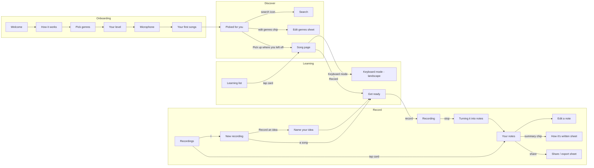

# Aria — Design handoff spec

iPhone app, iOS 17+, SwiftUI. Portrait everywhere except **Keyboard mode** (landscape). Light and dark mode.
Working name: **Aria**. Requirements: `00-requirements.md` (FR/NFR numbers below refer to it).

Live, clickable versions:

- **Screens canvas** (every screen, interactive, with Play mode): https://claude.ai/artifact/DAeyZApsjwYJxHs12eRcZf
- **Design system** (tokens, components, brand book): https://claude.ai/artifact/EN6MkMqDfH9Fk2HG9Cio8p

Both links are private until shared from their Share menu.

---

## 1. App structure

Four tabs in a glass tab bar, always visible except in full-screen/modal moments (recording, transcribing, editing, keyboard mode, sheets):

| Tab | Home screen | What lives there |
|---|---|---|
| **Discover** | Picked for you | Recommendations, search, genre editing |
| **Learning** | Learning list | Songs she's learning → song page → keyboard mode |
| **Record** | Recordings | All recordings (songs + ideas) → new recording → transcription → notes |
| **Library** | *(not designed yet)* | Learned songs and ideas (FR-37) |

### Navigation map

---

## 2. Global rules

- **Background:** every full screen sits on the gradient (`AriaBackground` in `AriaTheme.swift`). Content sits on **glass** cards.
- **One dark action per screen.** `primary` (near-black pill / disc; light in dark mode) is only for the main action: Get started, Continue, Save, Mark as learned, Share, the big play disc. Actions inside cards are light: the soft "Want to learn" pill and the glass play disc.
- **Playing in place.** On Discover, Search and Recordings, tapping play on a card plays that song *in the card* — the play icon turns into pause, the card doesn't move, and only one song plays at a time (starting another stops the previous). There is no floating mini-player.
- **Cards that open a page** (Learning list, Recordings) are fully tappable; on Learning cards the right-hand button is a chevron, not play.
- **Touch targets** ≥ 44 pt. **Dynamic Type** on all text (fonts are defined `relativeTo:` a text style). **VoiceOver** labels on every icon-only button (labels are in the prototype markup, e.g. "Play River Flows in You", "Not interested", "Back 5 seconds").
- **Reduce Transparency:** replace glass with `surfaceRaised` (handled in `AriaGlass`).
- **Focus ring / selection:** `accent` (orchid).
- **Status is never colour-only:** pills carry words (Learning, Learned, Idea), selected chips carry a check, lit keys carry note names.
- **Copy voice:** warm, short, second person, sentence case, no emoji. Name the loop the same everywhere: *Picked for you → Learning → Learned*; improvised recordings are *Ideas*.

---

## 3. Screens

Screens are 390 × 844 pt (iPhone 14/15/16). PNGs at @2x are in `03-screens/`. Where a dark version is included it's the same layout with the dark theme.

### 3.1 Onboarding (`03-screens/1-onboarding`)

| # | Screen | Key content | Behaviour |
|---|---|---|---|
| 1 | Welcome | Wordmark, waveform, "Learn the songs you love.", Get started | → How it works. Progress dots 1/5. |
| 2 | How it works | Three glass rows: Find songs / Learn by listening / Play it back | Next, Skip → Pick genres |
| 3 | Pick genres (FR-24) | 12 genre chips, Apple Music toggle (FR-27), "3 picked — nice mix" | Continue disabled until ≥ 3 genres. Toggle requests MusicKit permission when turned on. Dark version included. |
| 4 | Your level | 4 options with difficulty dots | Single choice (radio). Seeds recommendation difficulty. *Not in requirements — see open questions.* |
| 5 | Microphone | "Aria listens only when you ask." + 3 privacy promises | **Allow microphone** triggers the iOS permission prompt (NFR-2 purpose string). Not now → continues. |
| 6 | Your first songs | "12 songs picked for you", 2 recommendation cards | Start exploring → Discover. Must show ≥ 10 recommendations in the real feed (success criterion). |

### 3.2 Discover (`03-screens/2-discover`)

**1 · Picked for you** (FR-25, FR-26, FR-29, FR-30)

- Eyebrow "Made around you", title, search button (→ Search).
- Her genres as compact dark chips + a round sliders chip → **Edit genres** sheet. Chips wrap to a second line rather than being cut off.
- "Pick up where you left off" glass row → the song page of the most recent Learning song.
- **Recommendation cards** (SongCard, `recommendation`): title, artist · genre, difficulty (dots + word). Glass play disc plays the song in place (30-sec preview for non-subscribers, FR-30). **+ Want to learn** → adds to Learning list; the button turns into "✓ Added to Learning" (tap again to undo). **✕** removes the card and records "not interested" feedback (FR-26).
- *No "I know it" button* — product decision; FR-26's "already know" needs to be dropped from requirements or moved to a menu.
- *No "For you" pill* on recommendation cards.

**2 · Search** (FR-33) — search field (songs, artists, composers), level filter chips (All levels / Easy / Intermediate). Results are **the same full cards** as Discover (play/pause in place, Want to learn, ✕). A song already on her list shows as a Learning card.

**3 · Edit genres** — bottom sheet over Discover; same 12 chips; ≥ 3 required; Save refreshes recommendations.

**4 · Song — recommended** — full player for a recommended song with the 30-second preview notice and Want to learn. *Currently not reachable from Discover (cards play in place instead). Keep or drop — see open questions.*

### 3.3 Learning (`03-screens/3-learning`)

**1 · Learning list** (FR-33) — "Learning" title, + (→ search catalog), "4 songs", sort chip cycling *Recently added / Title / Most takes*. Each song is a card with title, artist · genre, Learning pill, difficulty, "Added Sep 12 · 3 takes" / "No takes yet". **Tapping a card opens the song page** (chevron on the right; no in-place play here).

**2 · Song page** (FR-29–32, FR-34, FR-35, FR-36)

- Top: back, "Learning · week 4", heart.
- Source switch: **Original · Recordings · My notes** (FR-32). The line above the title changes: "Original · Debussy" / "Recording · Sep 24, 4:12 PM" / "My notes · Sep 24 recording".
- Player: eyebrow, song title (hero), subtitle, waveform (played part glows), scrubber with times, **Loop** (FR-34), big play/pause disc, **Back 5s** (FR-31).
- **Keyboard mode** row (above the buttons) → Keyboard mode.
- Buttons: **Record** (→ Get ready for this song) and **Mark as learned** (primary, FR-36 → moves the song to Library).
- Tab bar with Learning selected.

**3 · Keyboard mode** — landscape, dark theme by default, full screen (844 × 390).

- Notes fall onto a 2½-octave keyboard (C3–E5 in the design; range should adapt to the piece). Keys light up while their note sounds and show the note name.
- **Left hand = orchid (`accent`), right hand = peach** with a small legend. Hand assignment comes from the score's staff split (FR-12).
- Left rail: back, play/pause, back 5s, loop. Right rail: vertical **speed** slider (40–120 %). Top: song + source, "Bar 12 of 72". Bottom: progress line.
- Notes come from her transcription (My notes). Showing the *original* song this way needs note data for it — see open questions.

### 3.4 Record (`03-screens/4-record`)

**1 · Recordings** (Record tab home; FR-21, FR-37) — "Recordings" title, dark **+** (new recording), search field, filter chips **All / Songs / Ideas**. Each recording is a card: name, date · time, Learning / Idea / Learned pill, length · "notes ready" or "no notes yet", play/pause in place. Tap the card → **Your notes**. Empty search shows "No recordings match '…'".

**2 · New recording** — "What are you playing?" → **Record an idea** (→ Name your idea) or pick one of the songs she's learning (→ Get ready).

**3 · Name your idea** — bottom sheet: name field (required), "Saved with today's date: Sep 28, 2026 · 9:41 PM", Continue.

**4 · Get ready** — (song and idea versions)

- Title = song or idea name. "Will be saved as **Clair de Lune — Sep 28, 2026 · 9:41 PM**". *Naming rule:* songs are named `<song title> — <date> · <time>`; ideas `<her name> — <date> · <time>`.
- Settings card: **Count-in** switch (FR-4, 4 clicks in headphones only), **Tempo** stepper 40–200 BPM in steps of 5, **Microphone** picker (built-in / USB / Bluetooth, FR-1).
- Big red record button, "Put your phone near the piano, then tap", **Import an audio file instead** (FR-5 — Files / share sheet).
- *No level meter here* — it appears once recording starts.

**5 · Recording** (FR-2, FR-3, NFR-8) — live waveform, timer, level meter. Warnings: "Too quiet — move the phone closer to the piano." / "Too loud — move the phone further from the piano." Stop button (square = recording state shown by shape, not only colour). "Saved as you play · keeps going if your screen locks · Up to 10 minutes". No tab bar. Dark version shows the too-quiet warning.

**6 · Turning it into notes** (FR-6–8) — percentage, progress bar, four steps (Listening for notes → Finding the beat → Working out the key → Writing the score) that tick off, **Cancel**. "Happening on your phone — works offline, nothing is uploaded." Can be left; notify when done. Done → **See your notes**.

**7 · Your notes** (FR-9–17)

- Top: back (→ Recordings), date · time, **share** (→ Share sheet).
- Title = recording name.
- Summary chip "♩ 80 · 4/4 · D♭ major · eighths" → **How it's written** sheet.
- **Score / Piano roll** switch (FR-14, FR-17). Score: grand staff, key and time signature, the playing note glows orchid (FR-15).
- Player card: play/pause + **My recording / Piano** A/B switch (FR-16) + progress.
- **Edit** and **Save to <song>** (primary; for ideas this is simply "Save").

**8 · Edit a note** (FR-18, FR-20) — Done, undo / redo. Tapped note is ringed on the staff. Panel: note name ("C5 · quarter"), pitch down/up (steps within the key), length Eighth / Quarter / Half, Add note, Add rest, Delete. Edits re-render instantly (NFR-3, < 300 ms).

**9 · How it's written** sheet (FR-9–11, FR-19) — Tempo slider, Time signature (2/4, 3/4, 4/4, 6/8), Key ("D♭ major · 5 flats — Detected", tap to change), Shortest note (Quarter / Eighth / Sixteenth), Triplets switch. Changes regenerate the score without re-running the model.

**10 · Share** (FR-22) — choose **Sheet music (PDF)**, **MusicXML**, **MIDI** → iOS share sheet. "Only leaves your phone when you share it." (NFR-2)

---

## 4. Design system

- `02-design-tokens/tokens.json` — source of truth: colours (light + dark), type scale, spacing, radius, shadows, blur, each with a usage note.
- `02-design-tokens/AriaTheme.swift` — the same tokens as SwiftUI: `AriaColor.*` (auto light/dark), `AriaFont.*` (Outfit, Dynamic Type), `AriaSpace.*`, `AriaRadius.*`, `AriaBackground`, `.ariaGlass()`.
- `02-design-tokens/tokens.css` — CSS variables (used by the web prototype).
- **Font:** Outfit (SIL Open Font License) — download Regular, Medium and SemiBold from https://fonts.google.com/specimen/Outfit and add them to the app bundle (`UIAppFonts`). Clefs in the score use Noto Music (OFL) in the prototype; the real score renderer (Verovio / OSMD) brings its own music font.
- `04-components/COMPONENTS.md` — every component: purpose, props, states, rules. `component-props.d.ts` lists props; `web-reference-bundle.js/.css` is the working React implementation behind the prototype.
- `05-icons/` — Phosphor icon names, weights and SVGs (all three weights).

Key colours (light / dark):

| Token | Light | Dark | Use |
|---|---|---|---|
| grad-peach / grad-pink / grad-lilac | #F9D7C3 / #F1B6CF / #D3AAEC | #3B2230 / #3D1F3D / #2B1F4A | Screen gradient |
| ink / ink-muted | #33203A / #553F5D | #F8ECF4 / #C7B4CF | Text |
| primary / on-primary | #2A1D2E / #FFFFFF | #F8ECF4 / #2A1D2E | One main action, play disc, selected chips |
| accent | #7A3DAE | #D2B4FF | Orchid: progress, difficulty, focus, left hand |
| peach | #EC9275 | #F4A88C | Gradient start, right hand |
| record | #C93A57 | #FF8AA2 | Record button only |
| success / warning | #1F6C61 / #8A4F00 | #6FD0BF / #F3B562 | Learned / input warnings |

Contrast: `ink` and `ink-muted` meet 4.5:1 on every gradient stop, glass and solid surface in both themes. `line-strong` (chip / secondary-button outline) was deliberately lightened at the product owner's request and is ~2:1 — controls still carry a fill and a label.

---

## 5. Sample data in the designs

Song titles, artists, dates, take counts, the "12 songs" count, "About 3 weeks to learn", "Learning · week 4" and all notes on the staff / piano roll / keyboard are **illustrative only**. The Original source subtitle has a placeholder "[Pianist]" to be filled from Apple Music.

---

## 6. Not designed yet

- **Library** tab (FR-37): learned songs + ideas, search, sort by title / date / genre.
- Settings (microphone permission, iCloud sync FR-23, Apple Music connection).
- Rename / duplicate / delete a recording (FR-21) — suggest swipe actions on Recordings cards.
- Empty states (no recommendations offline, empty Learning list, no recordings yet), error states (transcription failed, mic permission denied), and the "notes ready" notification.
- Key picker detail, microphone picker detail, iPad.

## 7. Open questions for product

1. **"Already know"** (FR-26) was removed from the UI — drop it from requirements or add it to a "…" menu?
2. **Your level** onboarding step isn't in the requirements — keep?
3. **Song — recommended** page is unreachable now that cards play in place — keep it (e.g. from a long-press) or remove?
4. **Keyboard mode for the Original** needs note data for the song (ties to the sheet-music licensing question).
5. **Heart / favourite** on song pages isn't in the requirements — keep or remove?
6. Idea naming happens **before** recording — confirm (alternative: name after stopping).
